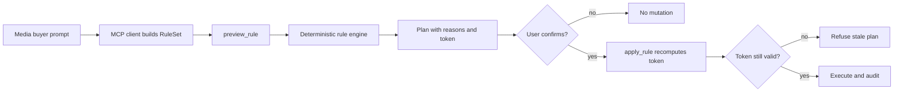

# AdOps MCP

**Manage native-ad campaigns by talking to them.**

[](pyproject.toml)
[](src/adops_mcp/server.py)
[](examples/demo.md)

AdOps MCP is an MCP server for media buyers who want to inspect, optimize, and control campaigns from an AI client instead of clicking through ad dashboards.

It connects Claude Desktop, Claude Code, Codex, or any MCP client to a native-ads backend. You can ask questions like "where am I wasting budget?", preview the exact campaigns that would change, and apply the plan only after an explicit confirmation token.

The current backend support is:

- **Mock backend**: default, offline, seeded with realistic campaign data for demos and tests.
- **Taboola Backstage backend**: live backend behind the same interface, configured with `BACKEND=taboola`.

## Why It Matters

Media buying has a repetitive optimization loop: read performance, find waste, scale winners, reduce bids, and keep an audit trail. AdOps MCP turns that loop into a conversational workflow while keeping the money-moving part deterministic and reviewable.

What makes it different:

- **Plain-English workflow, typed execution**: the MCP client converts intent into a structured `RuleSet`; the server never makes a second LLM call.
- **Dry-run first**: bulk changes go through `preview_rule`, which returns matched campaigns, reasons, resolved before/after values, and a `confirm_token`.
- **Token-gated apply**: `apply_rule` recomputes the plan and refuses stale or changed actions.
- **Guardrails and audit log**: bid and budget changes are bounded, and every planned/executed action is written to JSONL.
- **Backend seam**: the server, rule engine, and safety layer depend on one `AdPlatform` interface, so more ad platforms can be added without changing the tool contract.

## Demo


Demo assets to add for the repository landing experience:

- `demo.gif`: short preview/apply/audit walkthrough. Present in this repo.
- `demo.mp4`: higher-resolution narrated walkthrough. Placeholder.
- `screenshots/preview-rule.png`: dry-run with matched campaigns and reasons. Placeholder.
- `screenshots/audit-log.png`: planned and executed action history. Placeholder.

Run the scripted demo in [examples/demo.md](examples/demo.md). It uses the mock backend, so no ad-platform credentials are required.

## Quick Start

Install with [`uv`](https://docs.astral.sh/uv/):

```bash
git clone <this-repo>
cd adops-mcp
uv sync
uv run --extra dev pytest
uv run mcp dev src/adops_mcp/server.py
```

Or run the stdio server directly:

```bash
uv run python -m adops_mcp
```

The default backend is `mock`, which loads 10 seeded campaigns and writes audit events to `audit_log.jsonl`.

## Connect An MCP Client

### Claude Desktop

Add this to `claude_desktop_config.json`:

```json
{
  "mcpServers": {
    "adops": {
      "command": "uv",
      "args": ["run", "--directory", "/absolute/path/to/adops-mcp", "python", "-m", "adops_mcp"]
    }
  }
}
```

### Claude Code

```bash
claude mcp add adops -- uv run --directory "$(pwd)" python -m adops_mcp
```

### Codex

```bash
codex mcp add adops -- uv run --directory "$(pwd)" python -m adops_mcp
```

Then open your client and ask:

```text
List my campaigns.
Which campaigns should I pause today?
Where am I wasting budget?
Explain what drove an efficiency drop using CPA, CTR, CPC, spend, and conversions.
Preview an optimization plan for wasteful spend and low-CPA winners.
Show me the audit log.
```

See [examples/sample_rules.txt](examples/sample_rules.txt) for more prompts.

## Example Workflow

Ask:

```text
Preview: pause anything spending over $50 with no conversions in the last 48 hours.
```

The MCP client calls `preview_rule` with a typed `RuleSet`. The server returns a dry run:

```text
[MOCK] 2 action(s) would run. Review, then call apply_rule with the confirm_token to execute.
- Pause 'Holiday Gift Guide - Desktop' (currently RUNNING).
  reason: spend $63.40 > $50.00 over 48h and conversions 0 == 0 over 48h
- Pause 'Cold Prospecting - Broad' (currently RUNNING).
  reason: spend $71.50 > $50.00 over 48h and conversions 0 == 0 over 48h
confirm_token: aff1180e9f6f4b58
```

If the plan looks right, ask:

```text
Apply it.
```

The client calls `apply_rule` with the token. If campaigns changed between preview and apply, the token no longer matches and the server refuses to run the stale plan.

## Tool Surface

| Tool | Type | What it does |
| --- | --- | --- |
| `list_campaigns(status?)` | read | List campaigns and computed stats such as CPA and CTR. |
| `get_campaign(campaign_id)` | read | Fetch one campaign with latest normalized stats. |
| `get_performance_report(start_date, end_date, dimension?)` | read | Return normalized performance rows for a date range. |
| `get_audit_log(limit?)` | read | Show recent planned and executed actions. |
| `pause_campaign(campaign_id, reason)` | write | Pause one campaign immediately and audit it. |
| `resume_campaign(campaign_id, reason)` | write | Resume one campaign immediately and audit it. |
| `set_campaign_bid(campaign_id, cpc, reason)` | write | Set an absolute CPC bid with guardrails. |
| `set_campaign_budget(campaign_id, daily_budget, reason)` | write | Set an absolute daily budget with guardrails. |
| `preview_rule(ruleset)` | safe | Dry-run a typed ruleset and return actions, reasons, rejections, and a token. |
| `apply_rule(ruleset, confirm_token)` | write | Execute the previewed plan only when the token still matches. |
| `reset_mock_data()` | util | Re-seed the mock backend for a fresh demo. |

## Safety Model



The safety boundary is intentional:

- The model chooses parameters; the server makes deterministic decisions.
- `preview_rule` never mutates campaigns.
- `apply_rule` only executes a plan that still hashes to the preview token.
- Guardrails refuse non-positive bids/budgets and increases above configured caps.
- The audit log records backend label, campaign, action, before/after values, and reason.

## Live Taboola Setup

Copy `.env.example` to `.env` and set:

```bash
BACKEND=taboola
TABOOLA_CLIENT_ID=...
TABOOLA_CLIENT_SECRET=...
# Optional. If unset, the backend resolves the first allowed account.
TABOOLA_ACCOUNT_ID=advertiser-1
```

The Taboola backend handles OAuth2 client-credentials auth, token refresh, allowed-account resolution, campaign-summary reporting, and campaign mutations through `is_active`, `cpc`, and `daily_cap`.

Status note: the mock backend is the fully runnable demo surface. The Taboola backend is implemented against the verified Backstage API shape, but it has not been smoke-tested against a live account in this repository.

## Project Layout

```text
src/adops_mcp/
  server.py            # FastMCP tools and backend wiring
  config.py            # env loading and backend selection
  models.py            # Campaign, stats, planned actions, preview/apply results
  safety.py            # confirm tokens, guardrails, JSONL audit log
  backends/
    base.py            # AdPlatform interface
    mock.py            # seeded in-memory backend
    taboola.py         # live Taboola Backstage backend
  rules/
    schema.py          # RuleSet contract exposed to MCP clients
    engine.py          # pure deterministic evaluator
tests/                 # offline tests for schema, engine, safety, mock backend
examples/              # scripted demo and prompt examples
```

## Contest Submission Answers

### 1. What does this tool do?

AdOps MCP brings AI-assisted marketing operations into an MCP client. It helps marketers inspect campaign performance, identify waste, and generate actionable optimization plans without living inside ad-platform dashboards.

The workflow is local-first: campaign data is normalized before analysis, and the runnable demo uses local mock data with no credentials. That makes the same operating model suitable for exported ad-performance data such as CSVs, without requiring teams to start with complex API integrations or send raw campaign data through another SaaS workflow.

The output is designed to be operational, not just descriptive: which campaigns look inefficient, which budgets or bids should be changed, why each recommendation was made, and what would happen before anything is applied.

### 2. Why did I build this?

Marketers spend too much time manually reviewing campaign tables, comparing performance metrics, and turning the same observations into the same optimization decisions. Most AI marketing tools focus on writing ads, landing-page copy, or creative concepts; fewer help with the operational work after campaigns are already running.

I built this to show a simple, local-first way to interact with ad data using AI and MCP. The goal is to shorten the path from performance data to decisions, while preserving review, safety, and auditability before actions affect spend.

### 3. What would I build next?

The next step is deeper automation for campaign optimization: stronger anomaly detection, budget optimization suggestions, and recurring recommendations based on performance changes.

I would also add optional integrations with platforms such as Google Ads and Meta Ads, while keeping local/export-based analysis available for teams that do not want direct API connections. For execution, I would expand the current preview/apply model into an approval-based system for safe actions across accounts and users.

The long-term direction is to evolve AdOps MCP from an analysis tool into an AI marketing operations agent: one that finds issues, recommends actions, asks for approval, executes safely, and keeps a clear audit trail.
